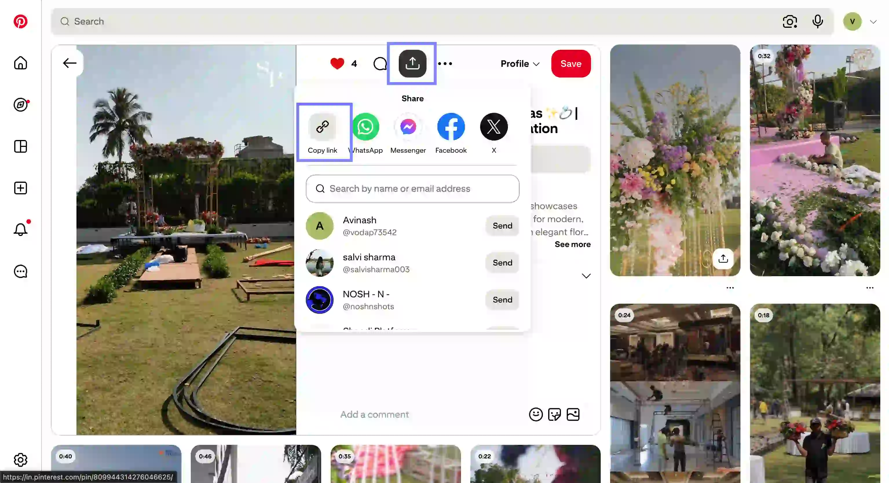
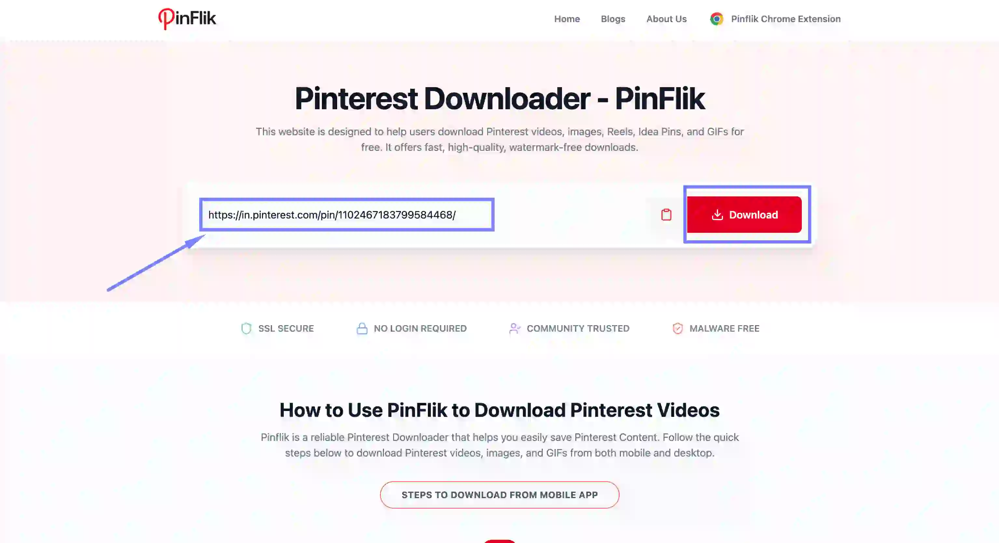
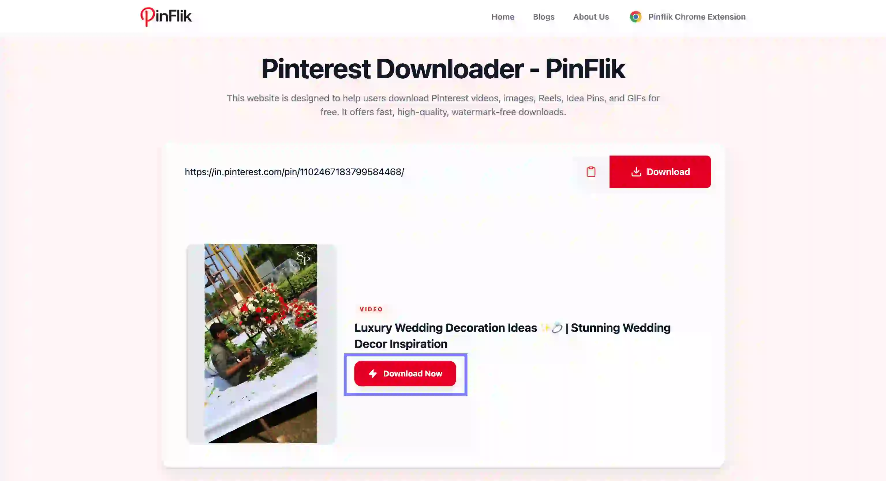

# PinFlik – Pinterest Video Downloader

> A product documentation repository for **PinFlik**, a browser-based Pinterest media downloader focused on simple workflows, high-quality media retrieval, privacy-conscious use, and support for multiple Pinterest media formats.

[](https://www.pinflik.com/)
[](https://www.pinflik.com/)
[](#documentation)

**Live product:** https://www.pinflik.com/

> **Repository scope:** This repository documents the PinFlik product, its purpose, core features, user experience, quality standards, semantic search intent, and roadmap for downloading high-quality Pinterest videos, images, GIFs, Reels, and Idea Pins effortlessly.

---

## Table of Contents

- [What is PinFlik?](#what-is-pinflik)
- [What problem does PinFlik solve?](#what-problem-does-pinflik-solve)
- [What can PinFlik download?](#what-can-pinflik-download)
- [How PinFlik works](#how-pinflik-works)
- [Core features](#core-features)
- [Download quality](#download-quality)
- [Why PinFlik?](#why-pinflik)
- [What makes PinFlik different?](#what-makes-pinflik-different)
- [Vision](#vision)
- [Mission](#mission)
- [Technology approach](#technology-approach)
- [Privacy and security](#privacy-and-security)
- [Responsible use](#responsible-use)
- [Supported URL types](#supported-url-types)
- [Who is PinFlik for?](#who-is-pinflik-for)
- [Documentation](#documentation)
- [Why the source code is not public](#why-the-source-code-is-not-public)
- [Disclaimer](#disclaimer)

## What is PinFlik?

**PinFlik is a Pinterest video downloader or Pinterest media downloader** that helps users save publicly accessible Pinterest videos, Reels/Idea Pins, images, GIFs, and other supported media through a simple browser workflow.

The product is designed around a straightforward interaction:

**Copy Pinterest link → Paste into PinFlik → Preview/process → Download**

PinFlik's public website describes the service as free to use, requiring no account or Pinterest login, and supporting desktop and mobile workflows. It also describes support for video, image, carousel, Story, Reel/Idea Pin, and GIF content. Actual availability can depend on the source Pin and Pinterest's current delivery formats.

## What problem does PinFlik solve?

Pinterest is primarily designed for downloading and saving ideas. Users may also want a local copy of publicly accessible media for legitimate personal reference, offline viewing, research, inspiration, or other permitted uses.

The problem is to solve third-party downloading experiences and improve downloading quality for user.

PinFlik is designed to reduce these friction while keeping the user responsible for copyright and permitted use.

- complicated interfaces;
- unnecessary registration steps;
- unclear download states;
- inconsistent media compatibility;
- quality loss;
- unnecessary software installation;
- privacy concerns;
- poor mobile experiences.

## What can PinFlik download?

Depending on the source Pin and currently available media, PinFlik supports:

- Pinterest videos;
- Pinterest Reels and Idea Pins;
- Pinterest images;
- Pinterest GIFs;
- Pinterest image carousels;
- Pinterest Story.

## How PinFlik works

At a production level, the workflow is very simple:

1. Find the video, image, or Reel you want to download on Pinterest.
2. Copy its link.
3. Paste the link into PinFlik.
4. Select your preferred quality and click Download to save it.

### Interface & Step-by-Step Workflow


| Step 1: Copy Link | Step 2: Paste Link | Step 3: Download Media |
| :---: | :---: | :---: |
|  |  |  |

PinFlik's public technical notice states that the service does not host or store Pinterest media on its own servers and that supported media is accessed from Pinterest's content delivery infrastructure.

### High-level workflow

```text
Pinterest Pin
     │
     ▼
Copy public Pin URL
     │
     ▼
PinFlik URL processing
     │
     ▼
Media / format detection
     │
     ▼
Available quality & format
     │
     ▼
Preview
     │
     ▼
User downloads permitted media
```

## Core features

### Simple browser workflow

No desktop software is required for the core web experience.

### No Pinterest login required

PinFlik is designed so users do not need to provide Pinterest account credentials to use the downloader.

### Multiple Pinterest media types

The product is designed around more than video-only downloading, including images, GIFs, Reels/Idea Pins, Stories, and carousels where supported.

### Quality-focused retrieval

PinFlik aims to expose the best quality available from the source rather than artificially increasing a lower-resolution file.

### Common media formats

The public product describes MP4 support for video and multiple image/animation formats depending on the media type and source.

### Mobile and desktop support

The website is designed for modern browsers on phones, tablets, and computers.

### Privacy-conscious design

The public product emphasizes no required registration and a privacy-first experience.

## Download quality

PinFlik's website currently describes support for HD video and higher resolutions such as 2K and 4K **when those qualities are available from the original source**.

This distinction matters:

> A downloader should not claim to create genuine 4K detail from an SD source.

PinFlik's quality philosophy is therefore based on **source availability and faithful retrieval**, not artificial upscaling.

Quality can vary because Pinterest may serve different media variants, formats, resolutions, or delivery paths for different Pins.

## Why PinFlik?

PinFlik is built around five priorities:

1. **Simplicity** — the user should understand what to do immediately.
2. **Quality** — preserve the best source quality that is actually available.
3. **Compatibility** — support multiple Pinterest media types rather than treating every Pin as a simple video.
4. **Privacy** — avoid unnecessary account and personal-data requirements.
5. **Reliability** — continuously improve compatibility as Pinterest formats and delivery behavior change.

## What makes PinFlik different?

The Pinterest downloader market contains many products with overlapping claims. PinFlik's intended differentiation is not simply "another downloader."

| Principle | PinFlik approach |
|---|---|
| User flow | Copy → paste → process → save |
| Account | No Pinterest login required |
| Media scope | Video plus supported images, GIFs, Reels/Idea Pins, Stories and carousels |
| Quality | Prefer the highest quality actually available |
| Watermark | Do not add a PinFlik watermark |
| Device experience | Browser-based mobile and desktop workflow |
| Privacy | Minimize unnecessary user information |
| Goal | Improve reliability, compatibility and UX over time |

## Vision

PinFlik's public About page describes a vision of becoming a trusted tool for people around the world who want a convenient way to save Pinterest content.

The broader vision is:

> **Make saving publicly accessible Pinterest inspiration simple, reliable, high-quality, and respectful of users and creators.**

## Mission

The public PinFlik mission is centered on providing a seamless, user-friendly way to download and save Pinterest images and videos without unnecessary complications.

The product mission can be summarized as:

> **Build a fast, simple and privacy-conscious Pinterest media utility that removes unnecessary friction from legitimate content saving.**

## Technology approach

The production implementation is private, so this repository does not expose source code, internal endpoints, credentials, infrastructure configuration, or proprietary extraction logic.

At a high level, the product consists of:

- a browser-based user interface;
- URL validation and normalization;
- media discovery and format detection;
- quality/format selection;
- preview and download handling;
- performance and reliability monitoring;
- legal and responsible-use controls.

The implementation details may evolve without changing the product's public purpose.

## Privacy and security

PinFlik's public website states that:

- no registration is required;
- Pinterest login credentials are not requested;
- personal data is not required for the core experience;
- the product is browser-based;
- the service does not host or store Pinterest media files on its own servers.

Users should still use current browsers, avoid submitting private credentials to third-party tools, and review the site's current privacy and terms pages before use.

See:

- [Privacy documentation](docs/privacy.md)
- [DMCA / copyright policy](https://www.pinflik.com/dmca-policy)

## Responsible use

PinFlik is intended for publicly accessible Pinterest content and lawful, permitted use.

Downloading a file does not automatically grant the downloader ownership, redistribution rights, commercial rights, or permission to republish the content.

Users are responsible for:

- respecting copyright;
- respecting creator rights;
- obtaining permission where required;
- following Pinterest's terms and applicable laws;
- using downloaded media only for lawful and permitted purposes.

PinFlik is not affiliated with, endorsed by, or officially connected to Pinterest or Pinterest Inc.

## Supported URL types

The public site documents support for Pinterest URLs such as:

```text
https://www.pinterest.com/pin/<PIN_ID>/
https://in.pinterest.com/pin/<PIN_ID>/
https://pin.it/<SHORT_CODE>
```

Support for a particular URL depends on whether the URL resolves to publicly accessible supported media.

## Who is PinFlik for?

PinFlik can be useful for:

- Pinterest users saving content for personal reference;
- designers collecting visual inspiration;
- students and researchers saving publicly accessible reference material;
- social media professionals organizing permitted creative references;
- creators archiving their own publicly posted media;
- users who want offline access to content they are allowed to save.

It should not be used to bypass access controls, download private content, or infringe another person's intellectual property rights.

## Documentation

### Core Product

- [Overview](docs/overview.md)
- [Features](docs/features.md)
- [How It Works](docs/how-it-works.md)
- [Quality](docs/quality.md)
- [Why PinFlik](docs/why-pinflik.md)
- [Comparison](docs/comparison.md)

### Product Story & Development

- [Mission](docs/mission.md)
- [Development Process](docs/development-process.md)
- [Challenges](docs/challenges.md)

### Discovery & Search

- [Search Intent](docs/search-intent.md)
- [Schema & Entity Notes](docs/schema-and-entity-notes.md)
- [Official Sources](docs/official-sources.md)

### Trust & Responsibility

- [Privacy](docs/privacy.md)
- [Content Responsibility](docs/content-responsibility.md)
- [FAQ](docs/faq.md)

## Why the source code is not public

The production downloader implementation is intentionally private.

This repository is public because transparency about the pinflik's purpose, capabilities, design philosophy, quality standards, limitations, and responsible-use principles is valuable without exposing proprietary implementation details.

The repository therefore contains:

- product documentation;
- public-facing research;
- high-level technical concepts;
- quality principles;
- UX principles;
- roadmap information;
- responsible-use guidance.

It does **not** contain:

- production extraction code;
- private APIs;
- server credentials;
- proprietary infrastructure configuration;
- internal monitoring credentials;
- private source repositories;
- implementation secrets.

## Disclaimer

PinFlik is an independent third-party utility and is not affiliated with, endorsed by, or officially connected to Pinterest or Pinterest Inc.

Pinterest is a trademark of Pinterest, Inc.

Users are responsible for ensuring that their use of downloaded material complies with applicable copyright laws, intellectual property rights, platform terms, and permissions from content owners.

---

## Website

**PinFlik — Pinterest Video Downloader**

https://www.pinflik.com/

For product updates and current capabilities, always refer to the live website.
